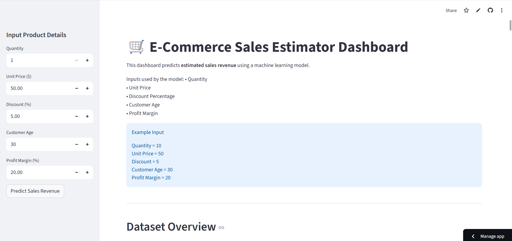

# 🛒 E-Commerce Sales Estimator

A Machine Learning web application that predicts estimated sales revenue for e-commerce products based on product and customer attributes.

[(https://ecommerce-sales-estimator-xuaqw52ngidnkqmw9fygax.streamlit.app)


## 🚀 Live Demo
🔗 https://ecommerce-sales-estimator-xuaqw52ngidnkqmw9fygax.streamlit.app

---

## 📌 Features

• Predict sales revenue using a trained ML model  
• Interactive dashboard with user inputs  
• Data visualization for dataset insights  
• Clean web interface built with Streamlit  

---

## 🧠 Technologies Used

- Python  
- Pandas  
- NumPy  
- Scikit-learn  
- Matplotlib  
- Streamlit  

---

## 📊 Project Workflow

1. Data preprocessing and exploration  
2. Machine learning model training  
3. Model saved using `joblib`  
4. Web app created using Streamlit  
5. Deployment using Streamlit Cloud  

---

## ▶️ Run Locally

Clone the repository

```bash
git clone https://github.com/jyothirmayejoguparthi-lgtm/Ecommerce-Sales-Estimator.git
