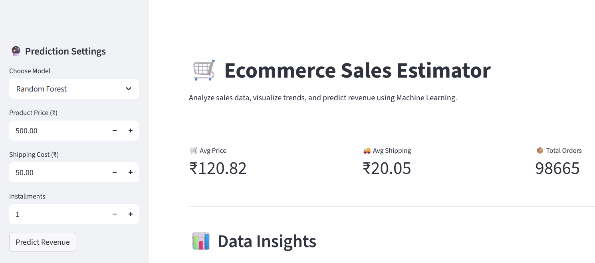
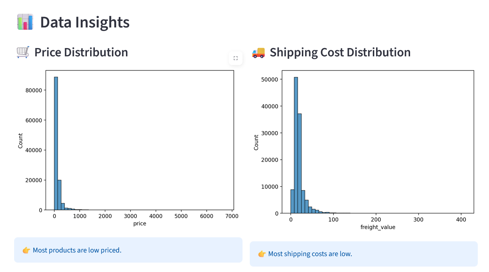
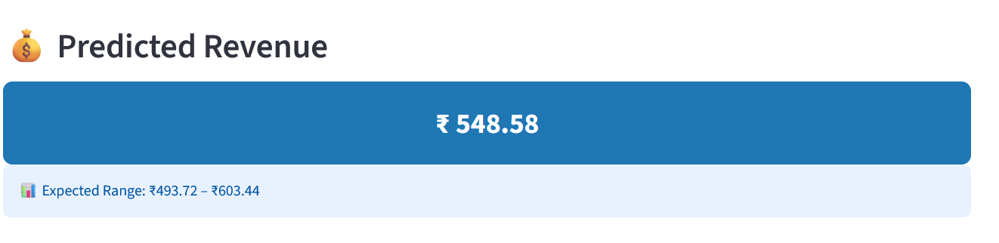

# 🛒 Ecommerce Sales Estimator

An interactive Machine Learning web application that analyzes e-commerce data and predicts revenue based on user inputs.

---

## 🚀 Live Demo
https://ecommerce-sales-estimator-xuaqw52ngidnkqmw9fygax.streamlit.app

---

## 📊 Features

- 📈 Data visualization (Price, Shipping, Correlation)
- 🤖 Multiple ML models (Linear Regression, Random Forest)
- 📊 Model comparison with R², MAE, RMSE
- 🔍 Feature importance visualization
- 🔮 Real-time revenue prediction
- 🎯 Confidence interval estimation
- 📂 CSV upload functionality
- 🧭 Sidebar for user inputs

---

## 🧠 Machine Learning Models

- Linear Regression
- Random Forest Regressor

---

## 📊 Model Performance

| Model | R² Score | MAE | RMSE |
|------|--------|-----|------|
| Linear Regression | 0.57 | 61.7 | 175.2 |
| Random Forest | 0.90 | 34.6 | 84.9 |

👉 Random Forest performs best on this dataset.

---

## 📁 Dataset

- Olist E-commerce dataset  
- Includes orders, items, and payment details  

---

## 🛠️ Tech Stack

- Python  
- Streamlit  
- Pandas  
- NumPy  
- Scikit-learn  
- Matplotlib  
- Seaborn  

---

## 📌 Project Highlights

- Built an end-to-end ML pipeline  
- Designed an interactive dashboard  
- Implemented model interpretability  
- Created a user-friendly prediction system  

---

## 📸 Screenshots

### 📊 Dashboard

### 📈 Data Insights

### 🔮 Prediction Output

---

## 👨‍💻 Author

Joguparthi Jyothirmaye
